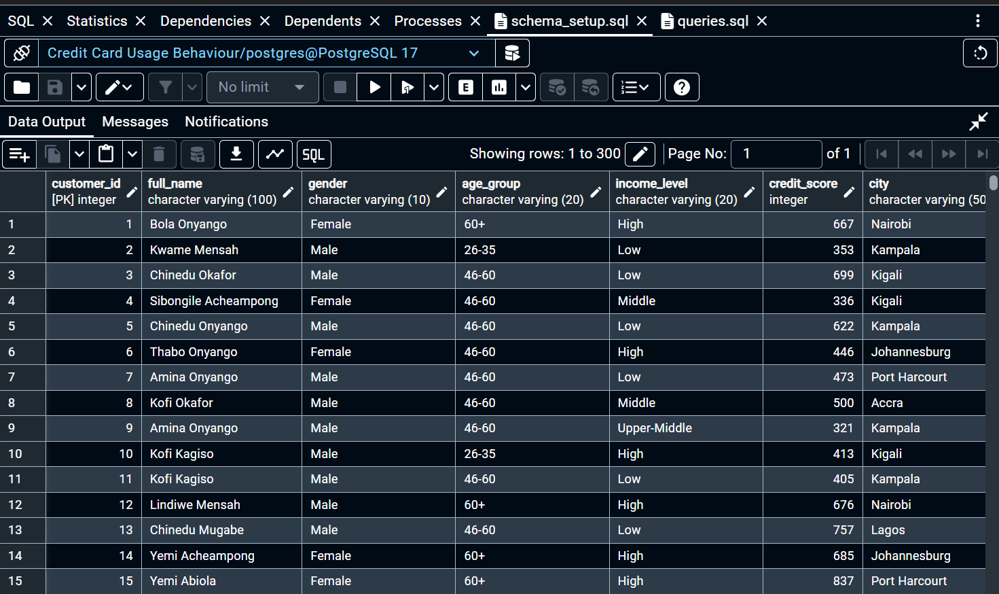
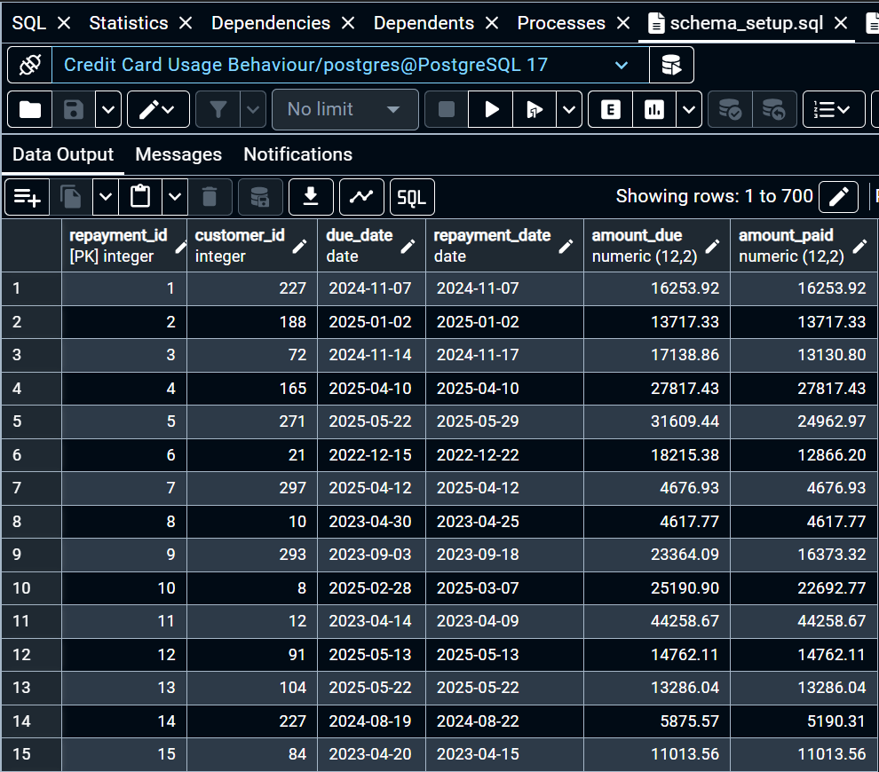

# Credit Card Usage Behavior & Profitability Analysis

## Table of Contents

1. [Project Overview](#project-overview)
2. [Objectives](#objectives)
3. [Business Context & Case Study](#business-context--case-study)
4. [Project Structure](#project-structure)
5. [Schema Design & Visuals](#schema-design)
6. [Key Queries & Insights](#key-queries--insights)
7. [Recommendations](#recommendations)
8. [Visuals](#visuals)
9. [How to Reproduce](#how-to-reproduce)
10. [Author](#author)

---
## Project Overview

This project analyzes customer behavior, repayment patterns, and profitability in a simulated credit card dataset using SQL. It provides insights into spending habits, repayment consistency, and identifies high-value customers using advanced query logic. The dataset and insights are tailored to reflect realistic banking scenarios in emerging economies like Nigeria.

---
## Objectives

* Understand customer spending behavior by demographic groups.
* Identify high-risk and high-value customer segments
* Evaluate profitability at customer and group level
* Segment customers for better decision-making and targeted upgrades.

---
## Business Context & Case Study

**Context:** A commercial bank operating across African regions has rolled out various card products. While card adoption is growing, profitability varies across customer segments. The bank wants to understand behavioral and financial patterns driving profitability and risk.

**Challenge:** Despite high transaction volumes, some customers accumulate unpaid debt, while others transact heavily but generate minimal profit. Management needs clarity on which segments to target for growth and which to manage better.

**Case Questions:**

* Are high-income customers spending more or repaying on time?
* Which channels and card types are most used by millennials or boomers?
* Which regions pose the highest credit risk?
* Who should be offered Platinum upgrades?

This analysis provides answers using clean, structured SQL logic grounded in real-world banking scenarios.

---
## Project Structure

```
├── README.md
├── schema_setup.sql         # SQL script to set up the database schema
├── queries.sql              # Main SQL analysis queries
├── screenshots/
│   ├── customer_table.png   # Preview of customer table
│   ├── repayment_table.png  # Preview of repayment table
│   └── transaction_table.png# Preview of transaction table
│
├── datasets/
│   ├── customers.csv
│   ├── transactions.csv
│   ├── repayments.csv
│   └── cards.csv
```
## 🧱 Schema Design

**Tables Used:**

* `customers`: Contains customer demographics, region, income level, and credit score
* `cards`: Stores card metadata – type, annual fee, reward rates
* `transactions`: Records all spending activity (with channel info)
* `repayments`: Logs actual repayments versus due amounts

Each table is connected via `customer_id` and `card_id` as appropriate.

## 🖼️ Visuals

| Customers Table                  | Transactions Table                     | Repayments Table                   |
| -------------------------------- | -------------------------------------- | ---------------------------------- |
|  |  |  |

---

## 🧾 Data Tables Preview

<table>
  <tr>
    <td></td>
    <td></td>
    <td></td>
  </tr>
  <tr>
    <td align="center">Customer Table</td>
    <td align="center">Transaction Table</td>
    <td align="center">Repayment Table</td>
  </tr>
</table>

---

## 🧠 Key Insights

### Card Usage Behavior

1. **Spending Patterns by Income Level & Region**

   * Higher income groups in urban regions tend to spend more and transact more frequently.
```sql
SELECT
    c.income_level,
    c.region,
    ROUND(SUM(t.amount), 2) AS total_spent,
    COUNT(t.transaction_id) AS transaction_count,
    ROUND(AVG(t.amount), 2) AS avg_transaction_amount
FROM transactions t
JOIN customers c ON t.customer_id = c.customer_id
GROUP BY c.income_level, c.region
ORDER BY c.income_level, c.region, total_spent DESC;
```

2. **Most Used Channel by Card Type & Age Group**

   * Younger customers (18–35) prefer digital channels for credit usage, especially with Platinum cards.

3. **Transaction Size & Frequency by Segment**

   * Medium-income customers showed higher average transaction sizes despite fewer total transactions.

### Repayment Behavior

4. **Late Payers**

   * 18.2% of customers have missed 3+ due dates, posing a credit risk.

5. **Repayment Rates by Age Group**

   * Customers aged 36–50 have the best repayment consistency.

6. **Unpaid Debt Over Time**

   * Notable spikes in unpaid debt during mid-year months, suggesting potential seasonal credit strain.

### Customer Profitability

7. **Top 10 Most Profitable Customers**

   * Profit = Annual Fee + (Spending × Reward Rate) - Unpaid Amount
   * These customers are consistent spenders with low default ratios.

8. **Group Contribution to Profit**

   * Urban, middle-aged, and upper-income groups contribute significantly to profit margins.

### Segmentation & Recommendations

9. **Customer Segments**

   * Segmented into: High Spenders (On-time vs Late), Medium Spenders, Low Spenders.

10. **Platinum Card Upgrade Targets**

* High spenders with excellent credit scores and low late repayment ratios.

11. **Regions Needing Financial Education or Credit Control**

* Regions with high overdue amounts and frequent late repayments need policy interventions.

12. **Year-on-Year Spending Growth by Income Group**
* Understand how each income group's credit usage is evolving to spot emerging segments.*

```sql
SELECT
    income_level,
    EXTRACT(YEAR FROM t.transaction_date) AS year,
    ROUND(SUM(t.amount), 2) AS total_spent
FROM transactions t
JOIN customers c ON t.customer_id = c.customer_id
GROUP BY income_level, year
ORDER BY income_level, year;
```

---

## ⚙️ Setup Instructions

1. **Run the schema**

   ```sql
   -- Run schema_setup.sql to create and populate tables
   ```
2. **Run the queries**

   ```sql
   -- Execute queries.sql to explore behaviors and insights
   ```
3. **Use PgAdmin or DBeaver** for optimal SQL interface and result visualization.

---

## 📌 Tools Used

* PostgreSQL (via PgAdmin)
* SQL (CTEs, Aggregations, CASE WHEN logic)
* Screenshots from database table previews

---

## 🧑‍💼 Author

**Durueke Franklin**
Data Analyst | Finance-focused Analytics | Portfolio-ready Projects

📧 [duruekefranklin@gmail.com](mailto:duruekefranklin@gmail.com)
🔗 [LinkedIn](https://linkedin.com/in/duruekefranklin)
💼 [GitHub Portfolio](https://github.com/DuruekeFranklin)

---

## ⭐ Final Thoughts

This analysis simulates a robust financial analytics use case involving behavior segmentation, credit risk evaluation, and profitability analysis. It can be extended into dashboard development, ML credit scoring, or campaign recommendation systems.


## 🔍 Key Queries & Insights

### 1. **Spending by Region & Income Level**

Analyzes total and average transaction values across regions and income groups to understand how wealth and location affect card usage.

### 2. **Top Channels by Age Group & Card Type**

Identifies whether mobile, POS, or online channels dominate usage by demographic – informing digital investment strategy.

### 3. **Transaction Frequency & Size**

Evaluates how frequently different segments transact and how much they spend, supporting segmentation.

### 4. **Repeated Late Payments**

Flags customers who miss due dates 3+ times – a credit risk metric used by lending teams.

### 5. **Repayment Rates by Age Group**

Benchmarks how well different age brackets repay their dues – e.g., Gen Z vs Gen X.

### 6. **Unpaid Debt Over Time**

Tracks growing debt month-over-month to assess portfolio risk and liquidity exposure.

### 7. **Customer-Level Profitability**

Estimates profitability by combining fees, rewards, and unpaid amounts – used to rank top 10 customers.

### 8. **Group-Level Profitability**

Aggregates profits by income, region, and age – guiding strategic targeting.

### 9. **Customer Segmentation**

Categorizes customers by behavior:

* High Spender, On-Time Payer
* High Spender, Late Payer
* Medium Spender
* Low Spender

### 10. **Upgrade Recommendations**

Selects customers eligible for Platinum upgrade using filters like total spend, credit score, and repayment behavior.

### 11. **Region-Level Risk**

Ranks regions with high overdue amounts and late payments to target financial education or policy tightening.

### 12. **(New) Card Type Profitability Comparison**

Compares average profit by card type to decide which cards are most financially viable for the bank.

```sql
SELECT 
  card_type,
  ROUND(AVG(annual_fee + total_spent * reward_rate - unpaid_amount), 2) AS avg_profit
FROM (
  SELECT
    cr.card_type,
    cr.annual_fee,
    cr.reward_rate,
    SUM(t.amount) AS total_spent,
    SUM(r.amount_due - r.amount_paid) AS unpaid_amount
  FROM cards cr
  JOIN transactions t ON t.card_id = cr.card_id
  JOIN repayments r ON t.customer_id = r.customer_id
  GROUP BY cr.card_type, cr.annual_fee, cr.reward_rate
) sub
GROUP BY card_type
ORDER BY avg_profit DESC;
```

## ✅ Recommendations

* **Offer Premium Upgrades**: Target high-spending, credit-worthy, on-time payers for Platinum upgrade.
* **Risk Management**: Review credit limits or apply stricter controls in regions with >30% late payments.
* **Customer Education**: Deploy campaigns in regions with low repayment performance.
* **Channel Optimization**: Invest more in mobile and POS channels where young customers dominate.


## 🧪 How to Reproduce

1. Clone the repository

```bash
git clone https://github.com/franklinanalytics/Credit-Card-Behavior-Analysis.git
cd Credit-Card-Behavior-Analysis
```

2. Import the `schema_setup.sql` file into your PostgreSQL or pgAdmin environment
3. Run the queries from `queries.sql`
4. Review visuals and insights

## 👤 Author

**Franklin Durueke**
Data Analyst | Financial Analysis | Business Intelligence
🔗 [LinkedIn](https://www.linkedin.com/in/franklinanalytics/)
📫 [franklinanalytics@gmail.com](mailto:franklinanalytics@gmail.com)

---

> 💬 *Feel free to fork, reuse, or contribute to this repository. Feedback and collaboration are welcome!*
